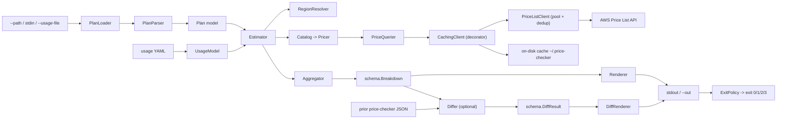

# Component Dependency — Price Checker

## Package dependency rules (enforced by layout + review)

```
cmd/price-checker
      -> internal/cli
internal/cli
      -> internal/config, internal/estimator, internal/diff, internal/render, internal/plan (types), pkg/schema
internal/estimator
      -> internal/plan, internal/pricing, internal/usage, internal/engine, pkg/schema
internal/diff
      -> pkg/schema            (only)
internal/render
      -> pkg/schema            (only)   // renderers know nothing about Terraform or AWS
internal/engine
      -> internal/plan (types), pkg/schema
internal/usage
      -> internal/plan (types), internal/pricing (Catalog, for skeleton), pkg/schema
internal/pricing
      -> internal/plan (types), internal/awsauth, pkg/schema
internal/pricing/aws  (Pricer impls)
      -> internal/pricing (PriceQuerier, types), internal/plan (types), pkg/schema
      -> MUST NOT import aws-sdk-go-v2
internal/awsauth
      -> aws-sdk-go-v2
internal/config
      -> pkg/schema (types only), gopkg.in/yaml
pkg/schema
      -> stdlib only (+ embedded *.schema.json)
```

**Key constraints**
- `pkg/schema` depends on nothing internal — it is the shared contract.
- `internal/render` and `internal/diff` depend on `pkg/schema` only (NFR-5.3).
- Only `internal/awsauth` and `internal/pricing` (layer-1 client) import the AWS SDK; `internal/pricing/aws` pricers do not (Q6 → A).
- No import cycles; `internal/plan` is a leaf providing types upward.

## Dependency matrix (row depends on column)

| ↓ depends on → | schema | plan | awsauth | pricing | pricing/aws | usage | engine | render | diff | config | estimator | cli |
|---|:--:|:--:|:--:|:--:|:--:|:--:|:--:|:--:|:--:|:--:|:--:|:--:|
| pkg/schema |  |  |  |  |  |  |  |  |  |  |  |  |
| plan | ✅ |  |  |  |  |  |  |  |  |  |  |  |
| awsauth |  |  |  |  |  |  |  |  |  |  |  |  |
| pricing | ✅ | ✅ | ✅ |  |  |  |  |  |  |  |  |  |
| pricing/aws | ✅ | ✅ |  | ✅ |  |  |  |  |  |  |  |  |
| usage | ✅ | ✅ |  | ✅ |  |  |  |  |  |  |  |  |
| engine | ✅ | ✅ |  |  |  |  |  |  |  |  |  |  |
| render | ✅ |  |  |  |  |  |  |  |  |  |  |  |
| diff | ✅ |  |  |  |  |  |  |  |  |  |  |  |
| config | ✅ |  |  |  |  |  |  |  |  |  |  |  |
| estimator | ✅ | ✅ |  | ✅ | ✅ | ✅ | ✅ |  |  |  |  |  |
| cli | ✅ | ✅ |  | ✅ |  | ✅ |  | ✅ | ✅ | ✅ | ✅ |  |
| cmd/price-checker |  |  |  |  |  |  |  |  |  |  |  | ✅ |

## Communication patterns

| Pattern | Where | Detail |
|---|---|---|
| Dependency injection via constructors | everywhere | `cli.App` builds the object graph once; no globals, no `init()` registration (Q5). |
| Decorator | `CachingClient` wraps `PriceListClient` | Same interface; cache is transparent to `Estimator` and pricers. |
| Strategy | `Pricer` (per resource type), `Renderer`/`DiffRenderer` (per format) | Selected from `Catalog` / `RendererFor`. |
| Bounded worker pool + singleflight | `PriceListClient` | One pool per run; identical `PriceQuery` deduplicated. |
| Pure function | `Differ.Diff`, `Aggregator.Build` | No I/O; enables property-based tests. |
| Ports & adapters | `internal/plan` (Terraform adapter in), `internal/pricing` (AWS adapter out), `internal/render` (format adapters out) | Core (`engine`, `schema`) has no third-party imports. |

## Data-flow diagram



### Text alternative

```
input (--path | stdin | dir) --> PlanLoader --> PlanParser --> Plan model
usage YAML --> UsageModel

Estimator consumes (Plan model, UsageModel) and, per resource:
  RegionResolver -> region
  Catalog -> Pricer -> PriceQuerier
      PriceQuerier = CachingClient(decorator) -> PriceListClient(worker pool + dedup) -> AWS Price List API
      CachingClient <-> on-disk cache (~/.price-checker/cache)
  -> priced components + not-estimated entries
Aggregator folds priced results -> schema.Breakdown

Optional: Differ(base Breakdown OR prior JSON, proposed Breakdown) -> schema.DiffResult

Renderer(Breakdown) or DiffRenderer(DiffResult) -> stdout or --out
ExitPolicy(outcome, config) -> process exit code 0/1/2/3
```

## Build / implementation order (units)

```
pkg/schema   (written first; every unit depends on it)
   |
   v
U1 plan-ingest
   |
   v
U2 pricing-core        (needs U1 + pkg/schema)
   |
   v
U3 cost-engine         (needs U1 + U2)
   |
   +--> U4 output-renderers   (needs U3)   --+
   |                                         |
   +--> U5 diff               (needs U3,U4) -+
                                             |
                                             v
                                        U6 cli-app   (needs U1..U5)
```

- U4 and U5 can proceed in parallel once the `schema.Breakdown` shape is frozen in U3.
- U6 integrates continuously and finishes last.

- **`pkg/schema` is written first** (types + JSON Schema files) — every unit depends on it.
- `U1` and `pkg/schema` unblock `U2`.
- `U3` needs `U1` + `U2`.
- `U4` and `U5` need `U3`; they can proceed in parallel once the `schema.Breakdown` shape is frozen.
- `U6` integrates continuously and finishes last (config, CLI, exit policy, packaging).

## Failure isolation

| Failure | Contained by | Effect |
|---|---|---|
| One resource type unsupported | `Catalog.For` miss | `NotEstimated{UNSUPPORTED_TYPE}`, run continues |
| One Price List query fails | `PriceListClient` retry then give up | `NotEstimated{PRICING_API_ERROR}` for affected resources only |
| Corrupt cache entry | `CacheStore.Get` | Treated as miss, refetched |
| Concurrent runs sharing cache dir | atomic temp+rename writes | Both succeed |
| Malformed usage file | `UsageModel.Load` | Hard error → exit 1 (before pricing) |
| Renderer bug | isolated package, `pkg/schema`-only input | Cannot corrupt pricing; golden-file tests guard |
