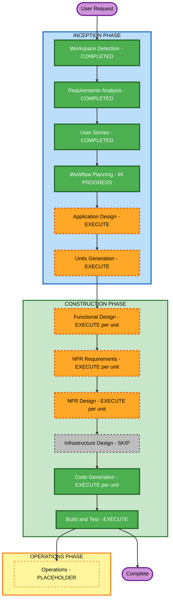

# Execution Plan — Price Checker

## Detailed Analysis Summary

### Project Type
Greenfield. No existing code; no reverse engineering. Target stack: Go CLI, AWS SDK for Go v2, AWS Price List Query API.

### Change Impact Assessment
- **User-facing changes**: Yes — a new CLI with 6 subcommands, 4 output formats, and a stable JSON/exit-code contract for automation.
- **Structural changes**: Yes — a new multi-package Go codebase must be designed from scratch (plan parsing, pricing client + cache, cost engine, renderers, diff, CLI).
- **Data model changes**: Yes — a Terraform-plan resource model, a cost-breakdown model, a JSON output schema, and a usage-file schema all need definition.
- **API changes**: Yes (outbound consumption) — mapping ~16 AWS resource groups to Price List service codes and filters; the public JSON schema and exit codes are a consumer contract.
- **NFR impact**: Yes — performance (concurrency, caching), reliability (decimal math, partial-failure tolerance), security/privacy (no plan data leaves the host, 0600 cache), testability (Partial property-based testing), portability (5-platform static binary).

### Risk Assessment
- **Risk Level**: Medium.
- **Rollback Complexity**: Easy — standalone tool, no deployed infrastructure, no data migration; each unit is independently revertible.
- **Testing Complexity**: Moderate — pricing correctness depends on recorded Price List fixtures; property-based tests for round-trips and aggregation invariants; golden-file tests for renderers.
- **Key unknowns**: exact Price List filter sets per resource type; Price List API throttling behaviour under concurrency; Terraform plan JSON edge cases (`known after apply`, aliased providers, nested modules).

---

## Workflow Visualization



### Text Alternative

```
INCEPTION PHASE
- Workspace Detection ......... COMPLETED
- Reverse Engineering ......... SKIPPED (greenfield)
- Requirements Analysis ....... COMPLETED
- User Stories ................ COMPLETED
- Workflow Planning ........... IN PROGRESS
- Application Design .......... EXECUTE
- Units Generation ............ EXECUTE

CONSTRUCTION PHASE (per-unit loop, then Build and Test)
- Functional Design .......... EXECUTE (per unit, where business logic exists)
- NFR Requirements ........... EXECUTE (per unit)
- NFR Design ................. EXECUTE (per unit)
- Infrastructure Design ...... SKIP (CLI binary, nothing deployed to cloud)
- Code Generation ............ EXECUTE (per unit)
- Build and Test ............. EXECUTE (after all units)

OPERATIONS PHASE
- Operations ................. PLACEHOLDER
```

---

## Phases to Execute

### 🔵 INCEPTION PHASE
- [x] Workspace Detection (COMPLETED)
- [x] Reverse Engineering (SKIPPED — greenfield, no existing code)
- [x] Requirements Analysis (COMPLETED — approved 2026-08-29)
- [x] User Stories (COMPLETED — 5 personas, 30 stories, approved 2026-08-29)
- [x] Execution Plan (IN PROGRESS)
- [ ] **Application Design — EXECUTE**
  - **Rationale**: An entire multi-package Go application must be designed. Component responsibilities and the interfaces between them (notably the pluggable `Pricer` interface required by NFR-5, and the renderer-facing breakdown type) need explicit definition before decomposition.
- [ ] **Units Generation — EXECUTE**
  - **Rationale**: The system decomposes into ~6 loosely coupled units with a clear dependency order; the per-unit construction loop needs that breakdown, and some units can be built in parallel.

### 🟢 CONSTRUCTION PHASE (per-unit loop)
- [ ] **Functional Design — EXECUTE (per unit)**
  - **Rationale**: New data models and non-trivial business logic (plan attribute resolution, per-resource pricing rules, decimal cost aggregation, usage merging, diff semantics, not-estimated reason assignment). Executed for units that carry logic; a thin unit may get a minimal design.
  - **PBT-01 note**: Property identification is performed here for units with logic (Partial mode — advisory for PBT-01, but properties feeding PBT-02/03 must be captured).
- [ ] **NFR Requirements — EXECUTE (per unit)**
  - **Rationale**: Tech-stack selection is required (Go version, `aws-sdk-go-v2`, CLI framework, YAML lib, decimal lib, HTML templating, and the PBT framework `pgregory.net/rapid` per PBT-09). Performance targets (NFR-1) and privacy constraints (NFR-3) must be pinned per unit.
- [ ] **NFR Design — EXECUTE (per unit)**
  - **Rationale**: Follows NFR Requirements. Concurrency/worker-pool design, cache format and atomicity, backoff strategy, secret-scrubbing boundaries, and deterministic-output mechanisms need design.
- [ ] **Infrastructure Design — SKIP**
  - **Rationale**: The deliverable is a self-contained CLI binary. It consumes the AWS Price List API but provisions and deploys nothing — no VPC, compute, storage, or IaC. The only "infrastructure" is a GitHub Actions release/build pipeline, which is covered under Build and Test. If a hosted component is added later, revisit.
- [ ] **Code Generation — EXECUTE (ALWAYS, per unit)**
  - **Rationale**: Implementation planning and code generation for each unit, with PBT alongside example-based tests per the Partial enforcement set.
- [ ] **Build and Test — EXECUTE (ALWAYS)**
  - **Rationale**: Cross-unit build, unit + integration tests, golden-file renderer tests, PBT with seed logging in CI, multi-platform build verification.

### 🟡 OPERATIONS PHASE
- [ ] Operations — PLACEHOLDER

---

## Proposed Units of Work (finalized in Units Generation)

| Unit | Responsibility | Key stories | Depends on |
|---|---|---|---|
| `U1 plan-ingest` | Parse Terraform plan JSON (file/stdin), directory mode via `terraform show -json`, resource model, count/for_each expansion, known-after-apply handling | US-LOCAL-ESTIMATE-1, -2 | — |
| `U2 pricing-core` | AWS Price List client, SDK credential + region resolution, on-disk TTL cache (atomic, 0600, concurrency-safe), pluggable `Pricer` interface + v1 catalog, service-code/filter mappings with fixtures | US-PRICING-1..7, US-CACHE-1..3 | U1 |
| `U3 cost-engine` | Cost-breakdown data model, decimal aggregation (per-resource / per-module / total), usage-file parsing + merge, not-estimated reason assignment, coverage summary | US-LOCAL-ESTIMATE-3, -4, US-USAGE-1..3, US-PRICING-5 | U1, U2 |
| `U4 output-renderers` | Table, versioned JSON (+ schema), self-contained HTML report, github-comment Markdown; deterministic ordering; NO_COLOR/non-TTY; secret-scrubbing | US-LOCAL-ESTIMATE-3, -4, US-MACHINE-OUTPUT-1, -2, US-REPORT-1, US-PR-COMMENT-1, -2 | U3 |
| `U5 diff` | Cost-diff engine over two plans / prior JSON / single-plan-derived; diff data model; diff variants of each renderer | US-DIFF-1, -2, US-PR-COMMENT-2 | U3, U4 |
| `U6 cli-app` | Cobra CLI, subcommands, config file + flag/env precedence, exit codes, threshold gates, `--strict`, logging split, version metadata, release packaging (5 platforms) | US-CI-GATE-1, -2, US-CONFIG-INSTALL-1..3, US-PR-COMMENT-3 (later) | U1–U5 |

**Build order**: U1 → U2 → U3 → U4 → U5 → U6. U4 and U5 partially overlap once U3's breakdown type is frozen. `U6` integrates continuously but completes last.

---

## Estimated Timeline
- **Total stages to execute**: 5 remaining INCEPTION/CONSTRUCTION design stages (Application Design, Units Generation) + per-unit loop across 6 units (Functional Design, NFR Requirements, NFR Design, Code Generation each) + Build and Test.
- **Rough effort**: Application Design + Units Generation ≈ 1 working session each; per-unit construction ≈ 6 units × (design + code) with U2 and U3 the largest; Build and Test ≈ 1 session. AI-DLC checkpoints gate each.

## Success Criteria
- **Primary Goal**: A Go CLI that reads a Terraform plan JSON and prints a trustworthy monthly + hourly AWS cost estimate (USD) from live Price List data, with explicit not-estimated reporting.
- **Key Deliverables**: `price-checker` binary (5 platforms); `breakdown`/`diff`/`report`/`usage generate` subcommands; table + JSON + HTML + github-comment output; TTL'd on-disk cache; usage-file support + generator; CI exit codes + threshold gates; README with schema, exit codes, and a GitHub Actions recipe.
- **Quality Gates**:
  - All v1-tagged stories' acceptance criteria demonstrably met.
  - `go vet`, `gofmt`, `golangci-lint` clean; example-based + property-based tests green in CI with logged seeds.
  - Price List mappings covered by recorded-fixture tests; renderers covered by golden-file tests.
  - 200-resource plan within the NFR-1 latency budgets.
  - No plan attribute values in cache/logs/reports beyond cost-relevant identifiers.
